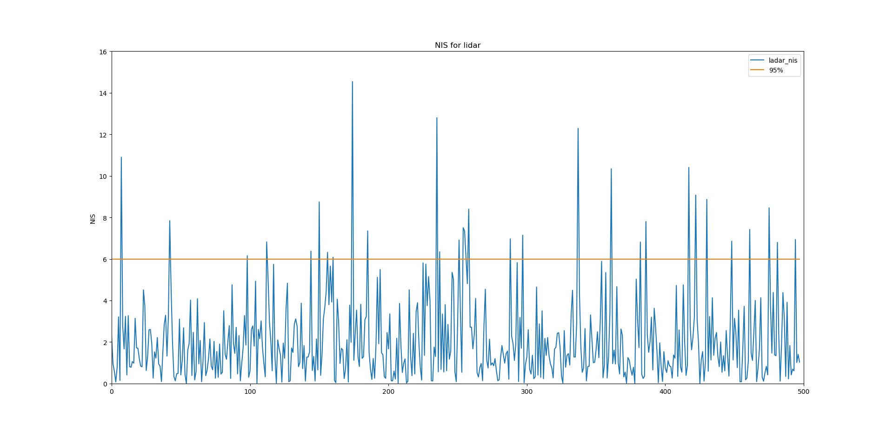

# Unscented Kalman Filter Project
Self-Driving Car Engineer Nanodegree Program

In this project I utilize a kalman filter to estimate the state of a moving object of interest with noisy lidar and radar measurements. You can find the project code in [src](https://github.com/hankkkwu/SDCND-Unscented_Kalman_Filter/tree/master/src) folder.

Here is how my code work in the simulator:

Consistency check (NIS) for lidar measurements: 

Consistency check (NIS) for radar measurements:

## Installation and environment set up for Windows 10 users

This project involves the Term 2 Simulator which can be downloaded [here](https://github.com/udacity/self-driving-car-sim/releases).

For windows you can use either Docker, VMware, or even Windows 10 Bash on Ubuntu to install uWebSocketIO.

Here's steps for Ubuntu BASH:
* Follow this [step by step guide](https://www.howtogeek.com/249966/how-to-install-and-use-the-linux-bash-shell-on-windows-10/) for setting up the utility.
* After setting up Ubuntu BASH, open Ubuntu Bash, and run the following commands inside the Linux Bash Shell:
1. `sudo apt-get update`
2. `sudo apt-get install git`
3. `sudo apt-get install cmake`
4. `sudo apt-get install openssl`
5. `sudo apt-get install libssl-dev`
6. `sudo apt install zlib1g-dev`
7. `git clone https://github.com/hankkkwu/SDCND-Unscented_Kalman_Filter.git`
8. `sudo rm /usr/lib/libuWS.so`
9. navigate to SDCND-Unscented-Kalman-Filter-Project
10. `./install-ubuntu.sh`
11. at the top level of the project repository `mkdir build && cd build`
12. from /build `cmake .. && make`
13. Launch the simulator from Windows and execute `./UnscentedKF` for the project. If you see this message `Listening to port 4567` `Connected!!!`, it is working!!
* Trouble Shooting

  * **.sh files not recognized on run**: Try `chmod a+x <filename.sh>` for example `chmod a+x install-ubuntu.sh`

## Installation and environment set up for Mac uers

This project involves the Term 2 Simulator which can be downloaded [here](https://github.com/udacity/self-driving-car-sim/releases).

This repository includes two files that can be used to set up and install [uWebSocketIO](https://github.com/uWebSockets/uWebSockets) for either Linux or Mac systems.

From the project repository directory run the script: `install-mac.sh`

Some users report needing to use `cmakepatch.txt` which is automatically referenced and is also located in the project repository directory.

* Trouble Shooting

  * **.sh files not recognized on run**: Try chmod a+x <filename.sh> for example chmod a+x install-mac.sh

  * **missing openssl, libuv, or cmake**: install-mac.sh contains the line `brew install openssl libuv cmake`, which will not execute properly if `homebrew` is not installed. To determine if `homebrew` is installed, execute `which brew` in a terminal. If a path returns it is installed, otherwise you see `brew not found`. Follow the guidance [here](https://brew.sh/) to install homebrew, then try running install-mac.sh again.

## Other Important Dependencies

* cmake >= 3.5
  * All OSes: [click here for installation instructions](https://cmake.org/install/)
* make >= 4.1 (Linux, Mac), 3.81 (Windows)
  * Linux: make is installed by default on most Linux distros
  * Mac: [install Xcode command line tools to get make](https://developer.apple.com/xcode/features/)
  * Windows: [Click here for installation instructions](http://gnuwin32.sourceforge.net/packages/make.htm)
* gcc/g++ >= 5.4
  * Linux: gcc / g++ is installed by default on most Linux distros
  * Mac: same deal as make - [install Xcode command line tools](https://developer.apple.com/xcode/features/)
  * Windows: recommend using [MinGW](http://www.mingw.org/)

## Basic Build Instructions

Once the install for uWebSocketIO is complete, the main program can be built and run by doing the following from the project top directory.

1. Clone this repo.
2. Make a build directory: `mkdir build && cd build`
3. Compile: `cmake .. && make`
4. Run it: `./UnscentedKF `

Here is the main protocol that main.cpp uses for uWebSocketIO in communicating with the simulator.

**INPUT**: values provided by the simulator to the c++ program

["sensor_measurement"] => the measurement that the simulator observed (either lidar or radar)

**OUTPUT**: values provided by the c++ program to the simulator

["estimate_x"] <= kalman filter estimated position x

["estimate_y"] <= kalman filter estimated position y

["rmse_x"]

["rmse_y"]

["rmse_vx"]

["rmse_vy"]

## Generating Additional Data

This is optional!

If you'd like to generate your own radar and lidar data, see the
[utilities repo](https://github.com/udacity/CarND-Mercedes-SF-Utilities) for
Matlab scripts that can generate additional data.

## Hints and Tips!

* Students have reported rapid expansion of log files when using the term 2 simulator. This appears to be associated with not being connected to uWebSockets.  If this does occur,  please make sure you are conneted to uWebSockets. The following workaround may also be effective at preventing large log files.

    + create an empty log file
    + remove write permissions so that the simulator can't write to log
